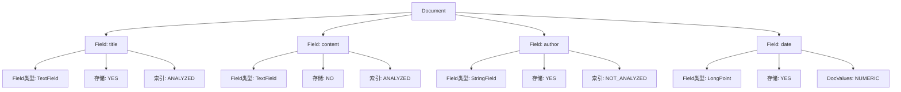
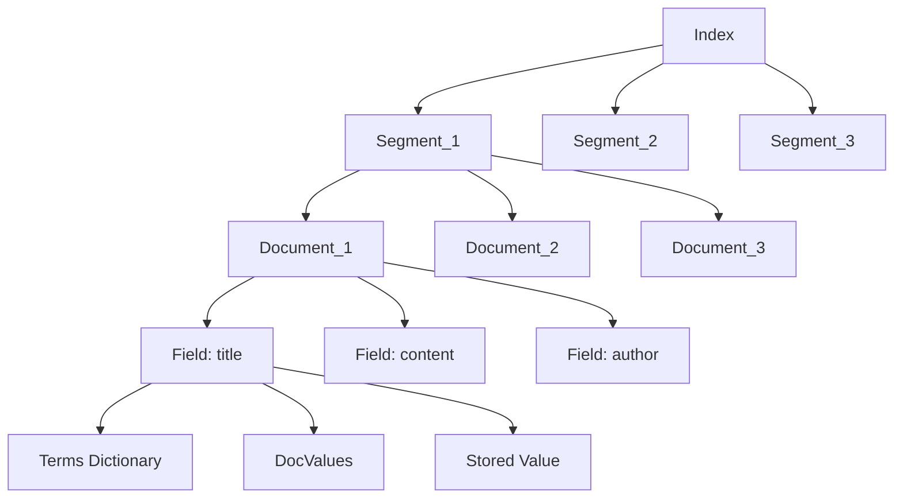
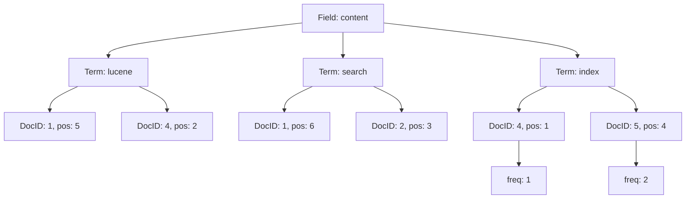
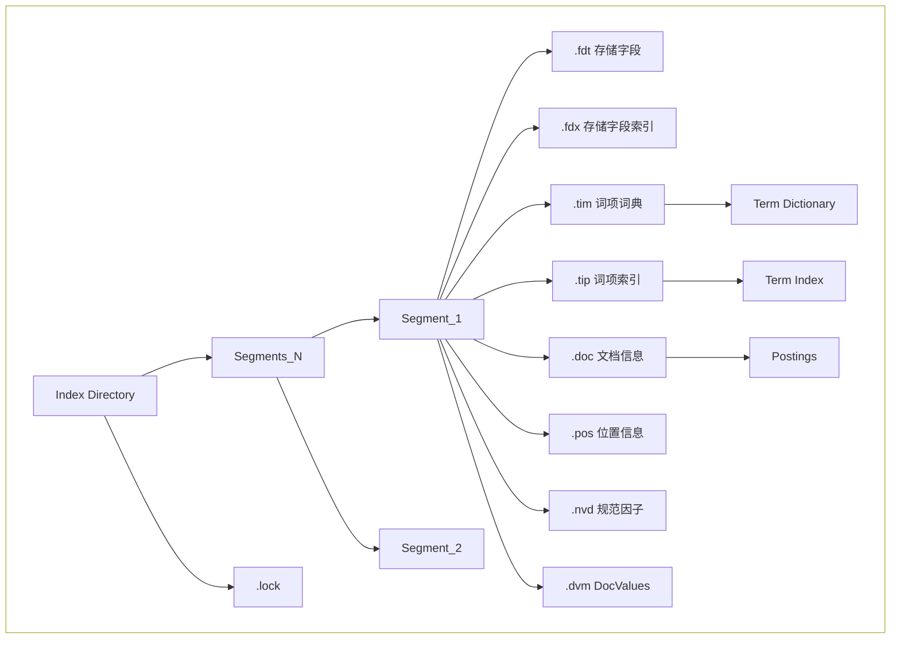

​	大家好，我是大伟， 由于现在工作主要是和Elasticsearch相关的，后续准备把自己这边积累的经验逐步写成文档，一方面是帮自己查漏补缺，一方面也是可以强化对相关内容的理解，后面准备先梳理Lucene存储相关的内容，会单独创建一个专题。第一篇内容就先简单介绍一下Lucene的一些基本概念和一些关键参数的设置区间，方便后续逐步深入。


## 1. 基本概念

**Document（文档）**

- 索引的基本单位
- 包含多个Field
- 有唯一的DocID

**Field（字段）**

- 文档的属性
- 可以有不同的类型和配置
- 决定了数据的索引和存储方式

**Term（词项）**

- 索引的最小单位
- 由Field名和词项值组成
- 指向包含该词项的文档列表

**Index（索引）**

- 由多个Segment组成
- 包含所有文档的倒排索引
- 管理更新和删除操作


下面我们通过几张图来比较直观的看下字段之间的关系，画布多说上图

**文档和字段的关系**

通过文档和字段的关系可以看出，一个文档包含多个字段，每个文档都有自己的唯一DocID




 **Field、Term、Document 和 Index 之间的关系**

下图展示了索引、Segment、Document、Field之间的关系，可以清晰的理解各基础概念之间的关系




**倒排索引的结构**

下图展示索引content字段通过分词之后生成的三个关键词的倒排索引信息，分别是lucene、search、index字段，通过term查询三个字符的时候可以很快的定位到对应的文档ID，这个就完成了查询的第一步Query，获取数据的时候就是根据文档ID再去fetch





**索引结构**

下面我们通过一个图展示索引的整体结构，一个索引下面拆分为很多Segment文件，每个Segment都有自己的存储格式，对应不同的名称和后缀



通过上面的图示我们可以看出各关键概念之间的关系

1. **Index -> Segment**
   - 一个索引包含多个段
   - 每个新段包含新增的文档
   - 段是不可变的
   - 多个段可以合并优化
2. **Segment -> Document**
   - 段包含多个文档
   - 文档在段内有唯一ID
   - 文档不能跨段存在
3. **Document -> Field**
   - 文档包含多个字段
   - 字段可以不同类型
   - 字段有不同的索引选项
4. **Field -> Terms**
   - 字段包含多个词项
   - 词项指向文档列表
   - 词项存储在词典中


## 2. 关键参数配置

### a. Field基础字段配置

| 场景     | indexOptions                 | docValuesType  | stored | storeTermVector | omitNorms | 说明             |
| -------- | ---------------------------- | -------------- | ------ | --------------- | --------- | ---------------- |
| 全文检索 | DOCS_AND_FREQS_AND_POSITIONS | NONE           | true   | true            | false     | 标准全文检索配置 |
| 精确匹配 | DOCS                         | NONE           | true   | false           | true      | 关键词匹配       |
| 排序字段 | NONE                         | SORTED         | false  | false           | true      | 仅用于排序       |
| 聚合字段 | NONE                         | SORTED_NUMERIC | false  | false           | true      | 用于聚合计算     |
| 存储字段 | NONE                         | NONE           | true   | false           | true      | 仅存储不索引     |
| 过滤字段 | DOCS                         | NONE           | false  | false           | true      | 仅用于过滤       |

### b. 特殊场景配置

| 场景     | 字段类型    | 特殊配置                                                 | 说明         |
| -------- | ----------- | -------------------------------------------------------- | ------------ |
| 地理位置 | LatLonPoint | pointDimensionCount: 2<br>pointNumBytes: 4               | 地理空间搜索 |
| 数值范围 | LongPoint   | pointDimensionCount: 1<br>pointNumBytes: 8               | 数值范围查询 |
| 向量搜索 | KnnVector   | vectorDimension: 384<br>vectorSimilarityFunction: COSINE | 向量相似度   |
| 分面统计 | 普通字段    | docValuesType: SORTED_SET                                | 分面导航     |
| 时间序列 | LongPoint   | docValuesType: NUMERIC                                   | 时间范围查询 |

### c. 高级优化配置

| 优化目标 | 配置项                           | 值             | 影响                             |
| -------- | -------------------------------- | -------------- | -------------------------------- |
| 索引大小 | omitNorms<br>indexOptions        | true<br>DOCS   | 减少规范因子存储<br>仅存储文档ID |
| 查询性能 | docValuesType<br>storeTermVector | SORTED<br>true | 快速排序<br>支持短语查询         |
| 内存占用 | stored<br>storeTermVector        | false<br>false | 不存储原文<br>不存储词向量       |
| 写入性能 | indexOptions<br>docValuesType    | DOCS<br>NONE   | 最小索引选项<br>无列式存储       |

### d. 常见应用场景配置

#### (1) 搜索引擎

| 字段         | 配置                                                                                 | 说明     |
| ------------ | ------------------------------------------------------------------------------------ | -------- |
| title        | indexOptions: DOCS_AND_FREQS_AND_POSITIONS<br>stored: true<br>storeTermVector: true  | 标题搜索 |
| content      | indexOptions: DOCS_AND_FREQS_AND_POSITIONS<br>stored: false<br>storeTermVector: true | 内容搜索 |
| url          | indexOptions: DOCS<br>stored: true<br>docValuesType: SORTED                          | URL索引  |
| lastModified | indexOptions: NONE<br>docValuesType: NUMERIC<br>stored: true                         | 时间排序 |

#### (2) 电商搜索

| 字段        | 配置                                                                  | 说明     |
| ----------- | --------------------------------------------------------------------- | -------- |
| productName | indexOptions: DOCS_AND_FREQS<br>stored: true<br>docValuesType: SORTED | 商品名称 |
| price       | pointDimensionCount: 1<br>docValuesType: NUMERIC<br>stored: true      | 价格范围 |
| category    | indexOptions: DOCS<br>docValuesType: SORTED_SET<br>stored: true       | 分类导航 |
| description | indexOptions: DOCS_AND_FREQS<br>stored: false<br>termVectors: true    | 描述搜索 |

#### (3) 日志分析

| 字段      | 配置                                                               | 说明     |
| --------- | ------------------------------------------------------------------ | -------- |
| timestamp | pointDimensionCount: 1<br>docValuesType: NUMERIC<br>stored: true   | 时间查询 |
| level     | indexOptions: DOCS<br>docValuesType: SORTED<br>stored: true        | 日志级别 |
| message   | indexOptions: DOCS_AND_FREQS<br>stored: true<br>termVectors: false | 日志内容 |
| traceId   | indexOptions: DOCS<br>docValuesType: SORTED<br>stored: true        | 追踪ID   |

### e. 性能影响参考

| 配置项        | 开启影响                       | 关闭影响                     | 建议         |
| ------------- | ------------------------------ | ---------------------------- | ------------ |
| stored        | 增加存储空间<br>支持原文获取   | 节省存储空间<br>无法获取原文 | 按需开启     |
| termVectors   | 支持短语查询<br>增加索引大小   | 节省空间<br>功能受限         | 重要字段开启 |
| docValuesType | 支持排序和聚合<br>增加存储空间 | 无法排序聚合<br>节省空间     | 排序字段必需 |
| omitNorms     | 节省空间<br>无法算相关度       | 支持相关度<br>增加空间       | 关键字段关闭 |
| indexOptions  | 增加索引功能<br>增加存储空间   | 节省空间<br>功能受限         | 按需配置级别 |


下面就是FieldInfo的基本代码结构，上面描述的各字段都有对应的定义

```java
public final class FieldInfo {
  /** Field's name */
  public final String name;
  /** Internal field number */
  public final int number;
  
  private DocValuesType docValuesType = DocValuesType.NONE;

  // True if any document indexed term vectors
  private boolean storeTermVector;
  private boolean omitNorms; // omit norms associated with indexed fields
  private final IndexOptions indexOptions;
  private boolean storePayloads; // whether this field stores payloads together with term positions
  private final Map<String, String> attributes;
  private long dvGen;

  /**
   * If both of these are positive it means this field indexed points (see {@link
   * org.apache.lucene.codecs.PointsFormat}).
   */
  private int pointDimensionCount;
  private int pointIndexDimensionCount;
  private int pointNumBytes;

  // if it is a positive value, it means this field indexes vectors
  private final int vectorDimension;
  private final VectorSimilarityFunction vectorSimilarityFunction;

  // whether this field is used as the soft-deletes field
  private final boolean softDeletesField;
```


好了，今天我们就写这么多循序渐进，把今天的基础知识内容吸收了，后面我们再逐步深入

